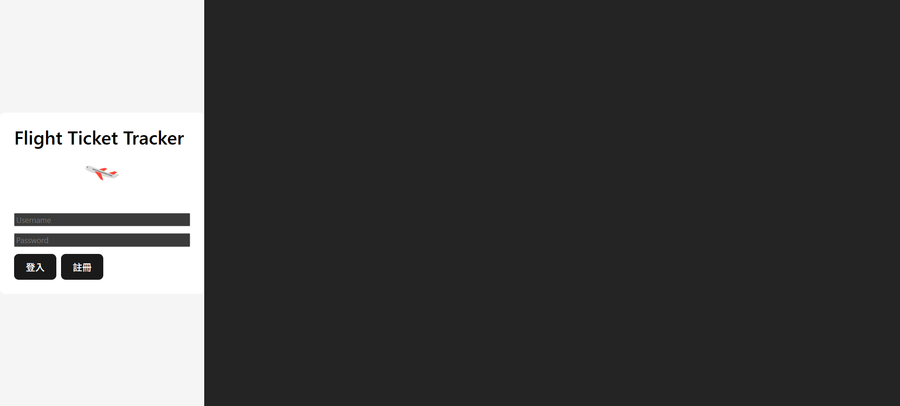
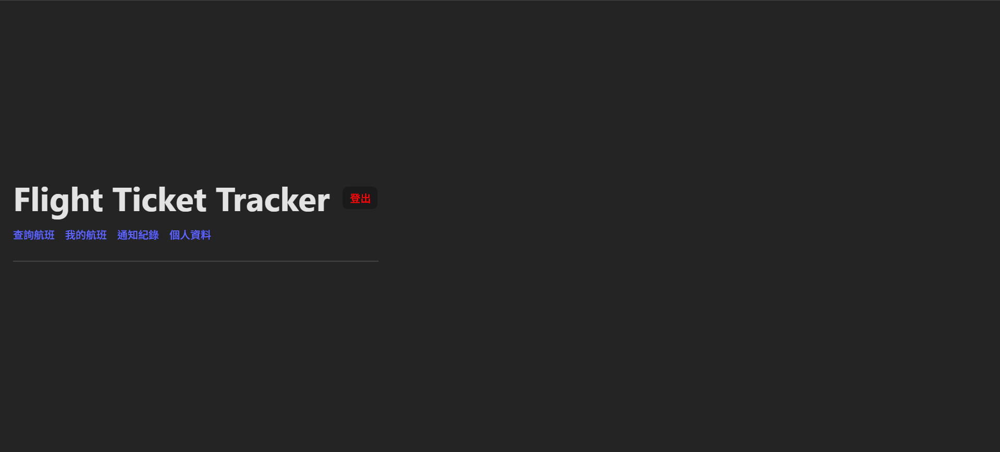
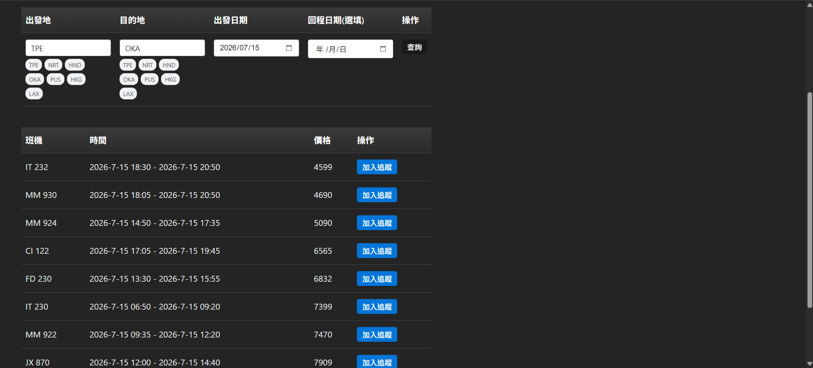
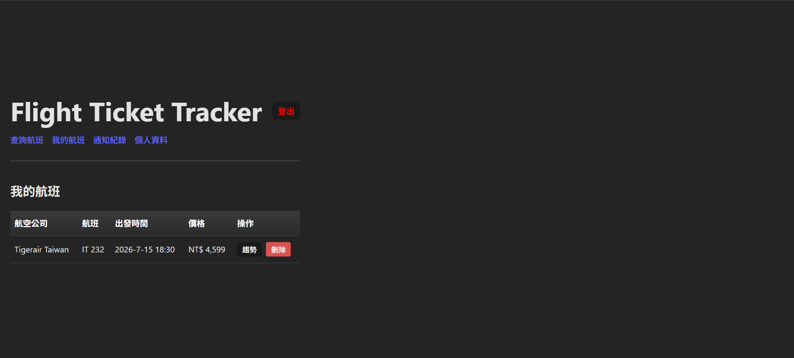
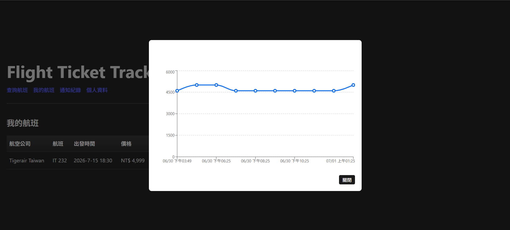
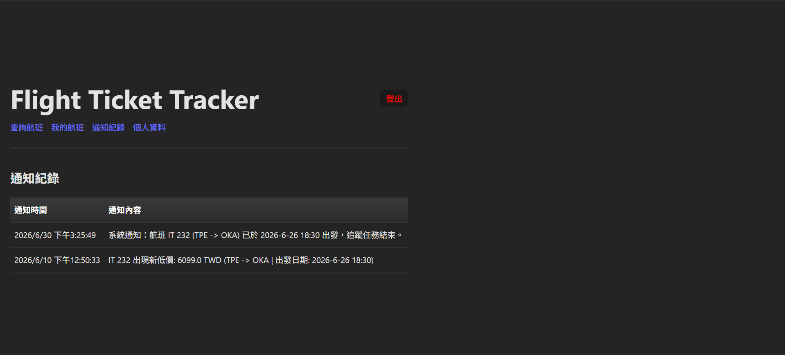
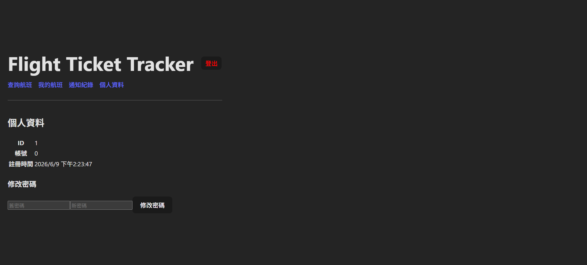

# Flight Ticket Tracker

An application that tracks the flight prices from time to time and notifies users when prices drop. <br>
There are three version (Desktop, Web and Mobile) for users.<br>
This is the **Web version**.<br>
Project main page: https://github.com/CY-Marowak/FlightTicketProject

	
## Tech Stack
1. 運行 React + Vite
2. 語言 TypeScript

## How to use
Go to webiste:<br>
https://flightticketwebproject.onrender.com/

## Web project structure
```text
src/
│
├─ api/                 # 所有 API 呼叫
│   ├─ client.ts        # Axios Client（自動帶 JWT）
│   ├─ auth.ts
│   ├─ flights.ts
│   ├─ notifications.ts
│   └─ profiles.ts
│
├─ auth/
│   ├─ AuthContext.tsx             # 全站登入狀態
│   └─ AuthProvider.tsx
│
├─ hooks/
│   └─ useAuth.ts
│
├─ pages/
│   ├─ Login.tsx
│   ├─ Register.tsx
│   ├─ Dashboard.tsx
│   ├─ Flights.tsx
│   ├─ TrackedFlights.tsx
│   ├─ Notifications.tsx
│   └─ Profile.tsx
│
├─ components/<
│   ├─ FlightTable.tsx
│   ├─ NotificationTable.tsx
│   └─ PriceChart.tsx
│
├─ routes/
│   └─ AppRoutes.tsx
│
├─ styles/
│   └─ table.css
│
├─ types/
│   ├─ auth.ts
│   ├─ common.ts
│   ├─ flights.ts
│   ├─ notifications.ts
│   └─ profile.ts
│
├─ utils/
│   └─ token.ts #Token 管理
│
├─ App.tsx
└─ main.tsx
```

---
## Result
<figure>
  <figcaption>登入</figcaption>
  
</figure>
<figure>
  <figcaption>首頁</figcaption>
  
</figure>
<figure>
  <figcaption>查詢航班</figcaption>
  
</figure>
<figure>
  <figcaption>我的航班</figcaption>
  
</figure>
<figure>
  <figcaption>價格趨勢</figcaption>
  
</figure>
<figure>
  <figcaption>通知紀錄</figcaption>
  
</figure>
<figure>
  <figcaption>個人資料</figcaption>
  
</figure>